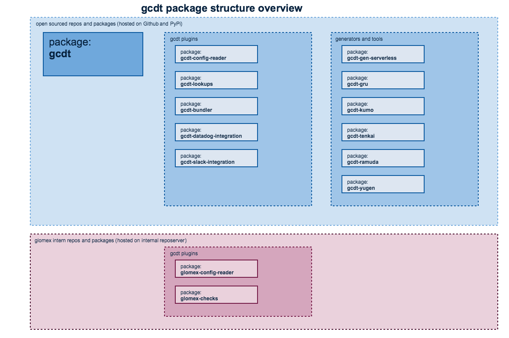

## Installing gcdt

This chapter covers the gcdt installation. gcdt's behaviour can be customized using plugins. The gcdt plugin mechanism relies on standard Python package mechanisms. In order to get a good experience and get the most out of gcdt you need to know a few things about Python packaging.

This chapter aims to provide you with all the information you need to know on this topic.


### Related documents

* [Python Package Index](https://pypi.python.org/pypi)
* [Version Identification and Dependency Specification](https://www.python.org/dev/peps/pep-0440/)
* [gcdt changelog](http://gcdt.readthedocs.io/en/latest/CHANGELOG.html)


### What you need to know about python package management

There is now a lot of packaging infrastructure in the Python community, a lot of technology, and a lot of experience. We will try cover some basic things and give you best practice what to use for Python package management.
1. **Always use `virtualenv`.** A virtualenv is effectively an overlay on top of your system Python install. Creating a virtualenv can be thought of as copying your system Python environment into a local location. When you modify virtualenvs, you are modifying an isolated container. Modifying virtualenvs has no impact on your system Python.
2. **Use `pip` for installing packages.** Python packaging has historically been a mess. There are a handful of tools and APIs for installing Python packages. As a casual Python user, you only need to know of one of them: pip.
If someone says install a package, you should be thinking create a `virtualenv`, activate a `virtualenv`, `pip install <package>`. You should never run `pip install` outside of a `virtualenv`. (The exception is to install `virtualenv` and pip itself, which you almost certainly want in your system/global Python.)
3. **Use `requirements` file for installing all project dependencies**. Always strictly specify the package version. Bad one: `somepackage=>2.0.3`. Good one: `somepackage==2.0.3`

Here is some useful links if you want dive deeper into Python package management.
* [A history of Python packaging](https://blog.startifact.com/posts/older/a-history-of-python-packaging.html)
* [Python Packaging Do's and Don'ts](https://gregoryszorc.com/blog/2014/07/15/python-packaging-do%27s-and-don%27ts/)
* [The Nine Circles of Python Dependency Hell](https://tech.knewton.com/blog/2015/09/the-nine-circles-of-python-dependency-hell/)


### gcdt package structure

The following diagram gives an overview on the gcdt packages. Please note how we grouped the gcdt packages in the following categories:

* gcdt - the gcdt core (livecycle mechanism, gcdt tools)
* gcdt plugins - packages to customize how you use gcdt
* gcdt generators and tools - scaffolding and tools to make your work even more efficient



At glomex we have very few (currently one) gcdt packages we do not want to open-source. The glomex-config-reader has very opinionated defaults on how we use gcdt on our AWS infrastructure that is very specific and optimized for our media usecase.


### Maintaining dependencies for your project

It is a very common practice not to install Python packages by hand. Instead dependencies and version are managed in a documented and repeatable way. Basically you add the names and versions of your packages to a text file. Most projects also group their dependencies into `direct` dependencies of the service or application and packages they need to develop, build, test and document.

The grouping is not enforced by packaging but to have a std. within an organization is beneficial especially if your want to reuse CI/CD tools.

A little opinionated but pretty common:

* `requirements.txt` tools and packages your service directly depends on
* `requirements_def.txt` tools and packages you need to develop and test your service
* `requirements_gcdt.txt` gcdt and gcdt plugins you use to deploy your service to AWS

The easiest way to install gcdt is via pip and virtualenv.

### Defining which gcdt-plugins to use

gcdt needs at least some gcdt-glugins so you should want to install these together. Add `gcdt` and the plugins you use to *requirements_gcdt.txt*

``` text
gcdt
gcdt-say-hello
gcdt-config-reader
gcdt-lookups
gcdt-bundler
gcdt-slack-integration
gcdt-datadog-integration
gcdt-gen-serverless
gcdt-kumo
gcdt-tenkai
gcdt-ramuda
gcdt-yugen
```

This is also a best practice to use the same `requirements_gcdt.txt` file on your build server, too.

### Setup virtualenv

Using virtualenvs for Python is considered best practice. This is what you need to do:
* create a virtualenv ('$ virtualenv venv')
* install the packages you want to use (see above)
* a virtualenv works basically like every other technical device, you need to switch it on before you can use it ('$ source ./venv/bin/activate')

Prepare the venv:

``` bash
$ virtualenv venv
```

Activate the venv for use:

``` bash
$ source ./venv/bin/activate
```
### Installing all dev dependencies in one go

Install the dependencies into venv:

``` bash
$ pip install -U -r requirements_gcdt.txt
```

Now you can start using gcdt:

``` bash
$ gcdt version
```

BTW, `gcdt version` shows you all the versions of gcdt and installed plugins. So you can use this to quickly check which plugins are installed.


### Deactivate a virtualenv

I do not throw away my lawn mower once I am done but with my terminals I do that. But you can deactivate a virtualenv:

``` bash
$ deactivate
```


### Updating gcdt

You should frequently update your gcdt installation to get access to new features and bugfixes.
 When updating your gcdt installation, please update gcdt and all the plugins. Just updating gcdt or a single plugin could easily break your gcdt installation.

``` bash
$ pip install -U -r requirements_gcdt.txt
```

This will update `gcdt` and all `gcdt plugins` specified in *requirements_gcdt.txt*


#### General remarks on "breaking changes" and deprecated features

We have two conflicting goals when maintaining gcdt:

* we want to introduce new features and replace older ones with newer implementations
* we want to be compatible with existing infrastructure and configurations

Besides that this is a pretty standard situation for a deployment tool and many other software projects. Nevertheless we want to make it explicit and consequently document here how we handle this.

We make sure that gcdt does work with our existing configurations. Frequent releases are ok but our squads expect downward compatibility for new patch versions. We could accept minor releases with breaking changes but expect an "update-documentation" which documents all steps that are necessary to upgrade.

We recently discussed and confirmed this in the gcdt grooming on 05.07.17 with representatives of the CO and VE squads.

In case we need to deprecate something we announce that in the [gcdt changelog](http://gcdt.readthedocs.io/en/latest/CHANGELOG.html) respectively in the changelog of gcdt plugins and tools.

The following sections go into `dependency specification` and provide information for how to upgrade from one version to the next.


#### Dependency specification (pinning versions)

Like we said above we guarantee compatibility with your installation procedures and configurations for patch versions. If you need to enforce compatibility it is recommended to best pin gcdt packages to minor versions in `requirements_gcdt.txt`.

This is just a sample, you need to pin to the actual versions you want to use:

``` text
gcdt==0.1.*
gcdt-config-reader==0.0.*
gcdt-lookups==0.0.*
gcdt-bundler==0.0.*
gcdt-slack-integration==0.0.*
gcdt-datadog-integration==0.0.*
gcdt-kumo==0.2.*
gcdt-tenkai==0.2.*
gcdt-ramuda==0.2.*
gcdt-yugen==0.2.*
```

Detailed information on [Version Identification and Dependency Specification](https://www.python.org/dev/peps/pep-0440/).


#### Updating gcdt from 0.1.x to 0.2.x

##### v 0.2.x removed long deprecated hook mechanism

No more 'pre_hook', 'pre_create_hook', 'pre_update_hook', 'post_create_hook', 'post_update_hook', 'post_hook' any more.

[list of available hooks to use](http://gcdt.readthedocs.io/en/latest/gcdt_plugins/15_plugin_mechanism.html#list-of-gcdt-signals)

##### with v 0.2.x you explicitly need to install all used gcdt tools
 
You need to install gcdt-tools (gcdt-kumo, gcdt-tenkai, gcdt-ramuda, gcdt-yugen). Please add the tools to your `requirements_gcdt.txt` like described in the installation section above. 


#### Updating gcdt from 0.0.x to 0.1.x

Initially gcdt was a "monolithic" application. We wanted to a plugin mechanism that gives us a little bit more flexibility so we can install `generators` (scaffolding), `plugins`, and `tools` as needed. With 0.1.x versions you need to maintain a `requirements_gcdt.txt` file for you project in order to define which plugins and tools you want to use (see installation section above). 
