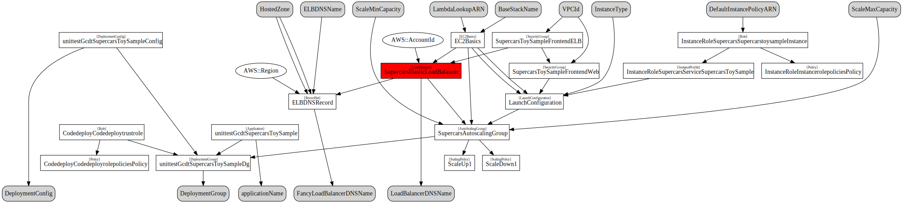

## kumo command

`kumo` (雲 from Japanese: cloud) is gcdts cloudformation deploy tool.


### Related documents

* [AWS CloudFormation service](https://aws.amazon.com/cloudformation/)


### Usage

To see available commands, call kumo without any arguments:

```bash
$ kumo
Usage:
        kumo deploy [--override-stack-policy] [-v]
        kumo list [-v]
        kumo delete -f [-v]
        kumo generate [-v]
        kumo preview [-v]
        kumo version
        kumo dot [-v]

-h --help           show this
-v --verbose        show debug messages
```


### Commands

#### deploy
will create or update a CloudFormation stack

to be able to update a stack that is protected by a stack policy you need to supply "--override-stack-policy"

#### list
will list all available CloudFormation stacks

#### delete
will delete a CloudFormation stack

#### generate
will generate the CloudFormation template for the given stack and write it to your current working directory.

#### preview
will create a CloudFormation ChangeSet with your current changes to the template

#### version
will print the version of gcdt you are using

#### dot
Visualize the cloudformation template of your stack using `kumo dot`.



Installation of the dot binary is required on your Mac to convert the graph into svg (http://www.graphviz.org/Download_macos.php).

``` bash
$ brew install graphviz
```

### Folder Layout

The folder layout looks like this:


`cloudformation.py` -> creates troposphere template, needs a method like this:

``` python
def generate_template():
    return t.to_json()
```

`gcdt_dev.json` -> settings for dev in json format, needs to include all parameters for the cloudformation template + stack name

Further settings files, depending on your environments in the format of `gcdt_<ENV>.json`


#### Config file example

```json
"stack": {
    "StackName": "sample-stack"
}
```
You like examples better than documentation? Check out our sample-stack at https://github.com/glomex/gcdt-sample-stack/tree/master/infrastructure


#### Configuring RoleARN for a cloudformation stack

There is a new Feature in CloudFormation which lets a User specify a Role which shall be used to execute the Stack. Docs can be found at http://docs.aws.amazon.com/AWSCloudFormation/latest/APIReference/API_CreateStack.html
This can be used to limit access of users drastically and only give CloudFormation the permission to do all the heavy lifting.

```json
"stack": {
    "RoleARN": "arn:aws:iam::<AccountID>:role/<CloudFormationRoleName>"
}
```
Make sure the role may be assumed by CloudFormation. See also: http://docs.aws.amazon.com/AWSCloudFormation/latest/UserGuide/using-iam-servicerole.html


#### Configuring NotificationARNs for a cloudformation stack

Amazon Simple Notification Service topic Amazon Resource Names (ARNs) that AWS CloudFormation associates with the stack. 

```json
{
  "kumo": {
    "stack": {
      "StackName": "infra-dev-kumo-sample-stack",
      "NotificationARNs": [
        "arn:aws:sns:eu-west-1:123456789012:mytopic1",
        "arn:aws:sns:eu-west-1:123456789012:mytopic2"
      ]
    },
    ...
```

Specify an empty list to remove all notification topics.


#### Setting the ENV variable

You you need to set an environment variable "ENV" which indicates the account/staging area you want to work with. This parameter tells the tools which config file to use. For example if you want to set the environment variable ENV to 'DEV' you can do that as follows:
``` bash
export ENV=DEV
```

This can also be exploited to have different configuration for different regions which is not yet directly supported.

``` bash
export ENV=DEV_eu-west-1
```

Will load the config file named `gcdt_dev_eu-west-1.json`


### Howto
1. create and fill `cloudformation.py` with the contents of your stack
2. create and fill `settings_<env>.conf` with valid parameters for your CloudFormation template
3. call `kumo deploy` to deploy your stack to AWS


### Kumo lifecycle hooks

Kumo lifecycle hooks work exactly like gcdt lifecycle hooks but have a specialized integration for kumo templates.

```python
def my_hook(params):
    context, config = params
    ...

def register():
    """Please be very specific about when your hook needs to run and why.
    E.g. run the sample stuff after at the very beginning of the lifecycle
    """
    gcdt_signals.initialized.connect(my_hook)


def deregister():
    gcdt_signals.initialized.disconnect(my_hook)
```

One kumo speciality for the `command_finalized` hook is that you can access the context attribute 'stack_output'. to access 
and use outputs of your stack within the hook implementation.


### Kumo legacy hooks

The hooks in this section are deprecated please use gcdt lifecycle hooks (see above).

**Please note the legacy hooks will be removed with the next minor release (v 0.2.0).**

kumo offers numerous hook functions that get called during the lifecycle of a kumo deploy run:

* pre_hook()
  * gets called before everything else - even config reading. Useful for e.g. creating secrets in credstash if they don't exist
* pre_create_hook()
  * gets called before a stack is created
* pre_update_hook()
  * gets called before a stack is updated
* post_create_hook()
  * gets called after a stack is created
* post_update_hook()
  * gets called after a stack is updated
* post_hook()
  * gets called after a stack is either updated or created

You can basically call any custom code you want. Just implement
the function in `cloudformation.py`

Multiple ways of using parameters in your hook functions:

* no arguments (as previous to version 0.0.73.dev0.dev0)
* use kwargs dict and just access the arguments you need e.g. "def pre_hook(**kwargs):"
* use all positional arguments e.g. "def pre_hook(awsclient, config, parameters, stack_outputs, stack_state):"
* use all arguments as keyword arguments or mix.
* with version 0.0.77 we decided to move away from using boto_sessions towards awsclient (more flexible and low-level).


### Using gcdt functionality in your cloudformation templates

Historically `cloudformation.py` templates imported functionality from gcdt and glomex_utils packages. With version 0.0.77 we consolidated and copied `get_env` over to gcdt.utils.

Made functionality available in gcdt (sounds awful but it was there already anyway) :
* gcdt.utils: get_env now available

Continued no changes:
* gcdt.iam: IAMRoleAndPolicies

The following functionality requires `awsclient` to lookup information from AWS. The `awsclient` is available in the cloudformation template only within the scope of a hook (see above). Consequently you need to execute your calls within the scope of a hook:
* gcdt.servicediscovery: get_outputs_for_stack
* gcdt.route53: create_record
* gcdt.kumo_util: ensure_ebs_volume_tags_autoscaling_group


### Accessing context and config in cloudformation

In the last few month we learned about a few usecases where it is desired to have access to config and context within your template. We had some workarounds using hooks but now there is a proper implementation for this feature.

In order to access context and config in your `cloudformation.py` you need to add both `context` and `config` as arguments to the `generate_template? function of your template:

``` python
def generate_template(context, config):
    template = troposphere.Template()
    ph.initialize(template, 'miaImportProcessor')
    assemble_particles(template, context, config)
    return template.to_json()
```

In case you do not want to use this information in your template you don't have to use it (like before).

``` python
def generate_template():
    ...
```


### Stack Policies
kumo does offer support for stack policies. It has a default stack policy that will get applied to each stack:

```json
{
  "Statement" : [
    {
      "Effect" : "Allow",
      "Action" : "Update:Modify",
      "Principal": "*",
      "Resource" : "*"
    },
    {
      "Effect" : "Deny",
      "Action" : ["Update:Replace", "Update:Delete"],
      "Principal": "*",
      "Resource" : "*"
    }
  ]
}
```
This allows an update operation to modify each resource but disables replacement or deletion. If you supply "--override-stack-policy" to kumo then it will use another default policy that gets applied during updates and allows every operation on every resource:

```json
{
  "Statement" : [
    {
      "Effect" : "Deny",
      "Action" : "Update:*",
      "Principal": "*",
      "Resource" : "*"
    }
  ]
}
```

If you want to lock down your stack even more you can implement two functions in your cloudformation.py file:

* get_stack_policy()
* * the actual stack policy for your stack
* get_stack_policy_during_update()
* * the policy that gets applied during updates

These should return a valid stack policy document which is then preferred over the default value.


### Signal handling

kumo receives a SIGINT or SIGTERM signal during a stack update `cancel_update_stack` is called for the stack.
